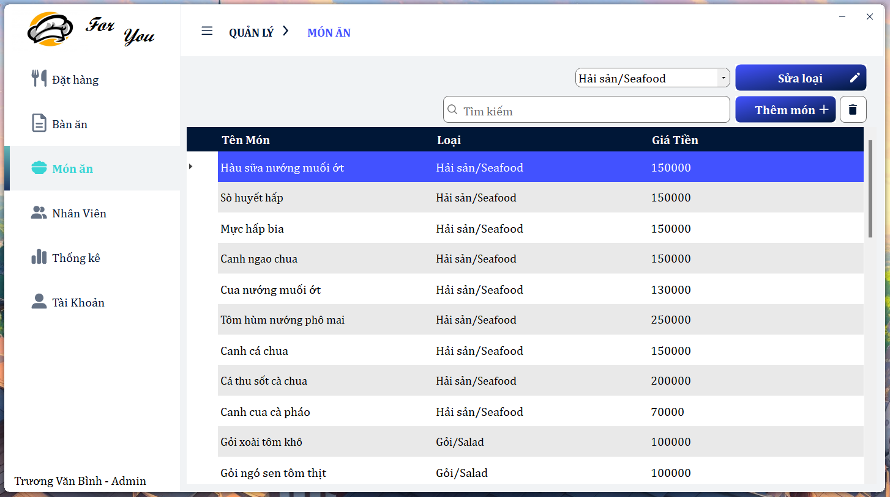

<!-- PROJECT LOGO -->

  

  <h3 align="center">Ứng dụng Quản lý Nhà Hàng</h3>

  

    Đây là 1 ứng dụng quản lý nhà hàng chạy trên hệ điều hành window, sử dụng .NET WindowForm để xây dựng !
     
    <a href="https://github.com/AndrewNguyen-05/QLNH_WF"><strong>Khám phá ứng dụng này »</strong></a>
     
     
    <a href="https://github.com/AndrewNguyen-05/QLNH_WF">Xem demo</a>
    ·
    <a href="https://github.com/AndrewNguyen-05/QLNH_WF/issues">Báo lỗi</a>
    ·
    <a href="https://github.com/AndrewNguyen-05/QLNH_WF/issues">Yêu cầu tính năng</a>
  

<!-- TABLE OF CONTENTS -->

  
Nội dung

  <ol>
    <li>
      <a href="#about-the-project">Về ứng dụng này</a>
      <ul>
        <li><a href="#built-with">Xây dựng với</a></li>
      </ul>
    </li>
    <li>
      <a href="#getting-started">Bắt đầu sử dụng</a>
      <ul>
        <li><a href="#installation">Cài đặt</a></li>
      </ul>
    </li>
    <li><a href="#usage">Hướng dẫn sử dụng</a></li>
    <li><a href="#contact">Liên hệ</a></li>
    <li><a href="#acknowledgments">Nguồn tham khảo</a></li>
  </ol>

<!-- ABOUT THE PROJECT -->

## Về ứng dụng này

Đây là ứng dụng giúp các nhà hàng quản lý công việc dễ dàng hơn. Ứng dụng Quản lý Nhà Hàng là một giải pháp toàn diện giúp các doanh nghiệp trong ngành dịch vụ nhà hàng tối ưu hóa quy trình quản lý và cung cấp trải nghiệm tốt nhất cho khách hàng. 

Dưới đây là mô tả chi tiết về các tính năng chính của ứng dụng:
1. Đặt Món và Tạo Đơn
    * Chọn Thức Ăn và Số Lượng:
      * Người dùng có thể dễ dàng chọn từ danh sách thực đơn đa dạng, đi kèm với mô tả chi tiết và hình ảnh hấp dẫn.
      * Mỗi món ăn có thể được tùy chỉnh với số lượng mong muốn.
    * % Giảm Giá:
      * Khách hàng có khả năng chọn % giảm giá cho đơn hàng của mình, tạo ưu đãi linh hoạt.
2. Giao Diện Đặt Hàng và Phục Vụ
    * Quản lý Đơn Hàng:
      * Nhân viên nhà hàng có thể theo dõi và quản lý các đơn hàng dễ dàng.
    * Giao diện phục vụ giúp nhân viên theo dõi tình trạng của mỗi đơn hàng, từ việc xác nhận đến giao hàng.
    * Thanh Toán và Xuất Hóa Đơn:
      * Người dùng có thể thanh toán trực tiếp từ ứng dụng và nhận hóa đơn điện tử chi tiết về đơn hàng của mình.
3. Quản Lý Bàn và Thực Đơn
    * Giao Diện Bàn:
      * Quản lý bàn dễ dàng với khả năng thêm, xóa, và sửa thông tin bàn.
      * Trực quan hóa tình trạng của bàn để nhân viên dễ dàng xác định bàn cần phục vụ.
    * Quản Lý Thực Đơn:
      * Thêm, xóa, và sửa thông tin về thực đơn một cách linh hoạt.
      * Loại bỏ hoặc thêm món ăn mới một cách dễ dàng để cập nhật thực đơn.
4. Giao Diện Tài Khoản và Đổi Mật Khẩu
    * Quản Lý Tài Khoản:
      * Người dùng có thể quản lý thông tin cá nhân, địa chỉ và thông tin thanh toán của mình.
      * Chức năng thêm, xóa, và sửa tài khoản đơn giản và tiện lợi.
5. Giao diện thống kê
    * Thống kê doanh thu theo ngày, tháng, năm giúp chủ doanh nghiệp dễ dàng quản lý thu nhập
6. Giao diện tài khoản
    * Đổi Mật Khẩu:
      * Bảo vệ thông tin cá nhân với khả năng đổi mật khẩu định kỳ.

(<a href="#readme-top">back to top</a>)

### Xây dựng với

### Frameworks và thư viện
    

(<a href="#readme-top">back to top</a>)

<!-- GETTING STARTED -->

## Bắt đầu sử dụng
Hướng dẫn cách cài đặt dự án về máy. Để có một bản sao ứng dụng có thể chạy được, làm theo những bước đơn giản sau đây:

### Cài đặt

Để có thể chạy được ứng dụng, yêu cầu cài đặt những thứ sau:
* <a href="https://visualstudio.microsoft.com/downloads/">Visual Studio 2022</a>, Community Edition để chạy mã nguồn
* <a href="https://www.microsoft.com/en-us/sql-server/sql-server-downloads">SQL Server 2019</a>, Express Edition (Lưu ý, phải đúng phiên bản Express Edition, nếu tải Developer Edition thì hãy tự chỉnh lại đường dẫn kết nối - connectionSTR trong DataProvider.cs nằm trong thư mục DAO)
* <a href="https://learn.microsoft.com/en-us/sql/ssms/download-sql-server-management-studio-ssms?view=sql-server-ver16">SMSS</a> để thao tác với database

1. Đầu tiên, hãy clone dự án này về máy và mở bằng Visual Studio 2022
2. Mở file Data.sql bằng SSMS, và nhấn F5 để SMSS chạy và tạo 1 database mới có tên là QLNH với đầy đủ dữ liệu
3. Vì ứng dụng này sử dụng 1 số thư viện Nuget ngoài để chạy, phụ thuộc vào thời điểm clone ứng dụng mà các thư viện sẽ có những thay đổi khác nhau, dẫn đến lỗi. Để giải quyết:
    * Đầu tiên, hãy chuột phải vào solution QLNH_Winform và chọn vào mục Manage Nuget Packages
   
   
    * Sau đó, hãy trỏ vào mục Updates, nhấn chọn select all và cuối cùng là update các thư viện Nuget
   

4. Bây giờ ứng dụng đã có thể chạy được, chỉ cần ấn nút Start và ứng dụng sẽ được khởi chạy. Tài khoản mật khẩu cho admin là: Admin - AD, mật khẩu cho nhân viên là ST1. Tài khoản cho nhân viên nằm trong database, mật khẩu trong database đã được mã hóa.

(<a href="#readme-top">back to top</a>)

<!-- USAGE EXAMPLES -->
## Hướng dẫn sử dụng

Có 5 màn hình chính, đặt hàng, bàn ăn, món ăn, nhân viên, thống kê, tài khoản
1. Màn hình đăng nhập
   * Sử dụng tài khoản, mật khẩu đã được cung cấp để đăng nhập, có thể là admin hoặc nhân viên
   
   
2. Màn hình đặt hàng
   * Trong màn hình này sẽ hiển thị các đơn đã được ghi nhận, có thể thay đổi, xóa, thanh toán, phục vụ
   
   
   
   
3. Màn hình thêm món
   * Màn hình này sẽ tạo 1 đơn hàng mới, có thể thêm sửa xóa các món ăn trong đơn đó, cũng như áp % giảm giá vào đơn bàn này, và chọn bàn. Ngoài ra cũng có thể tìm kiếm tên món ăn, hoặc lọc theo loại món.
   
   
   
4. Màn hình sửa đơn
   * Tương tự như thêm món, giao diện này giúp sửa những đơn đã được tạo
   
   
5. Màn hình bàn ăn
   * Quản lý các bàn hiện đang có trong nhà hàng
   
   
6. Màn hình món ăn
   * Quản lý các món ăn, cũng như loại món ăn trong nhà hàng
   
   
     
7. Màn hình nhân viên
   * Quản lý tài khoản các nhân viên và admin trong nhà hàng, có thể thêm xóa sửa tài khoản mới, cũng như đặt lại mật khẩu mặc định
   
     
8. Màn hình thống kê
   * Quản lý thu chi, có thể sắp xếp theo ngày, tháng, năm
   
     
9. Màn hình tài khoản
   * Giúp đổi mật khẩu
   

(<a href="#readme-top">back to top</a>)

<!-- CONTACT -->
## Liên hệ

* Nguyễn Văn Hoàng Anh - [Facebook](https://www.facebook.com/cua.vosi/) - 21520144@gm.uit.edu.vn (Chủ repo)
* Hoàng Đức Mạnh - [Facebook](https://www.facebook.com/hoangducmanh254) - 21520062@gm.uit.edu.vn
* Phan Ngọc Phước - [Facebook](https://www.facebook.com/profile.php?id=100010709087664) - 21520405@gm.uit.edu.vn

Project Link: [QLNH_Winform](https://github.com/AndrewNguyen-05/QLNH_WF)

(<a href="#readme-top">back to top</a>)

<!-- ACKNOWLEDGMENTS -->
## Nguồn tài liệu tham khảo

Đây là những nguồn tài liệu nhóm chúng mình đã sử dụng để có thể thực hiện được đồ án này!

* [Learn C#](https://learn.microsoft.com/vi-vn/dotnet/csharp/)
* [C# Tutorial by W3School](https://www.w3schools.com/cs/index.php)
* [Learn .NET](https://dotnet.microsoft.com/en-us/learn)
* [Learn Winform](https://learn.microsoft.com/vi-vn/dotnet/desktop/winforms/?view=netframeworkdesktop-4.8)
* [Winform](https://learn.microsoft.com/en-us/dotnet/desktop/winforms/getting-started-with-windows-forms?view=netframeworkdesktop-4.8)
* [Learn SQL](https://learn.microsoft.com/vi-vn/sql/sql-server/tutorials-for-sql-server-2016?view=sql-server-ver15)
* [SQL Tutorial by W3School](https://www.w3schools.com/sql/)

(<a href="#readme-top">back to top</a>)

